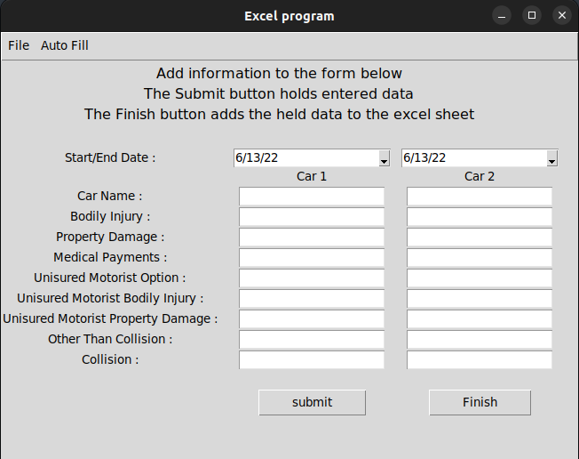

# Excel Premium Comparison Tool
This tool is to simplify data entry and Excel spreadsheet formating. The spread sheet is used to compare the difference between the biannual statements for an auto insurance policy with two vehicles.

## GUI
----

## Spreadsheet with test data
----

