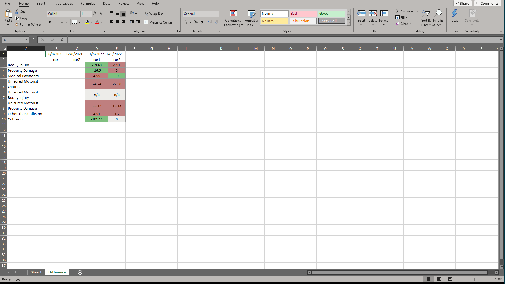

# Excel Premium Comparison Tool
This tool is to simplify data entry and Excel spreadsheet formating. The spread sheet is used to compare the difference between the biannual statements for an auto insurance policy with two vehicles.

Auto Fill feature takes an image of a document, gathers the needed values from the document and fills the entry fields 

## Made With
  * Python 3
  
  ### Gui
  * tkinter
  * tkcalendar

  ### Excel Format
  * openpyxl
  
  ### Image Input OCR
  * pytesseract
  * OpenCV

## GUI
----

## Spreadsheet with test data
----

## Sample of document used to auto fill
----

